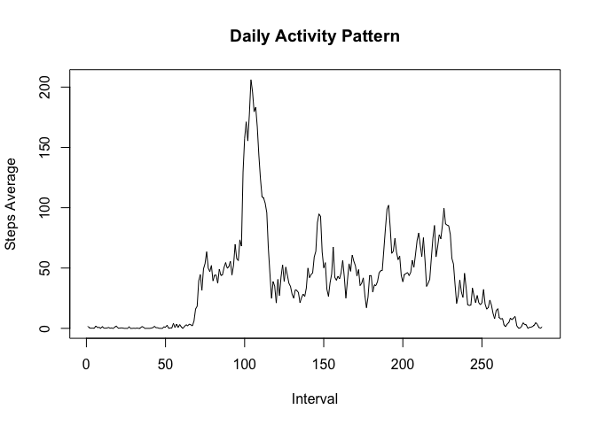

# Reproducible Research: Peer Assessment 1


## Loading and preprocessing the data

First, unzip and read extracted dataset:


```r
unzip("activity.zip")
activity <- read.csv("activity.csv", colClasses = c("numeric", "Date", "numeric"))
```

## What is mean total number of steps taken per day?

Sum steps per date, ignoring missing entries:


```r
steps <- with(activity, tapply(steps, date, sum, na.rm = TRUE))
hist(steps,
     main = "Total Number of Steps Taken per Day",
     xlab = "Total Steps")
```

 

```r
stepsMean   <- mean(steps)
stepsMedian <- median(steps)
```

The mean of steps by day is 9354.2295082 and the median is 1.0395\times 10^{4}. The values are shown in scientific notation.

## What is the average daily activity pattern?

Calculates the average per interval, ignoring missing values:


```r
average <- with(activity, tapply(steps, interval, mean, na.rm = TRUE))
plot(average, type = "l",
     main = "Daily Activity Pattern",
     xlab = "Interval",
     ylab = "Steps Average")
```

 

```r
maximum <- names(which.max(average))
```

Here we found that the maximum number of steps occurs at interval 835

## Imputing missing values

Just sum values not available on the dataset:


```r
missing <- sum(is.na(activity))
```

There are 2304 rows with missing data.

Here we will fill missing data with the average values we calculate previously:


```r
filled <- transform(activity, steps = ifelse(is.na(steps), average, steps))
summary(filled)
```

```
##      steps             date               interval     
##  Min.   :  0.00   Min.   :2012-10-01   Min.   :   0.0  
##  1st Qu.:  0.00   1st Qu.:2012-10-16   1st Qu.: 588.8  
##  Median :  0.00   Median :2012-10-31   Median :1177.5  
##  Mean   : 37.38   Mean   :2012-10-31   Mean   :1177.5  
##  3rd Qu.: 27.00   3rd Qu.:2012-11-15   3rd Qu.:1766.2  
##  Max.   :806.00   Max.   :2012-11-30   Max.   :2355.0
```

Now, we could calculate and compare with the first, non filled dataset:


```r
filledSteps <- with(filled, tapply(steps, date, sum))
hist(filledSteps,
     main = "Total Number of Steps Taken per Day (filled with Average By Interval)",
     xlab = "Total Steps")
```

 

```r
filledStepsMean   <- mean(filledSteps)
filledStepsMedian <- median(filledSteps)
```

The mean of steps by day is 1.0766189\times 10^{4} and the median is 1.0766189\times 10^{4}. The values are shown in scientific notation.

We can observe that not only the left most values are lower as also there is a greater concentration of values in the middle columns. This is a reflect of a lot more average values in our dataset. This shows how our strategy could have a bad impact in cases which our dataset has a large proportion of missing values.

## Are there differences in activity patterns between weekdays and weekends?

To compare, first we need to categorize our dataset by weekend/weekday. I've choose to use `format` with pattern `"%u"` since it will give the weekday number independent of the locale of running machine. The values `"6"` and `"7"` correspond to _saturday_ and _monday_ , respectively.


```r
filled$wday <- factor(format(filled$date, "%u") %in% c("6", "7"),
                      labels = c("Weekday", "Weekend"),
                      ordered = FALSE)

activityDiff <- with(filled, aggregate(steps,
                                       by = list(interval = interval, wday = wday),
                                       mean))
```

With the aggregated values by interval and weekday, we could plot the graph. Here I use the `lattice` library to reproduce the required graph:


```r
library(lattice)
xyplot(x ~ interval | wday, activityDiff, type = "l",
       layout = c(1, 2),
       main = "Activity Difference between Weekend and Weekdays",
       xlab = "Interval",
       ylab = "Number of Steps")
```

 
